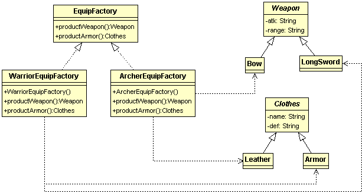

# 抽象工廠模式 Abstract Factory Pattern 1
#### 分類 建立物件

有了冒險者之後，他們還需要各種裝備才能出門探險，假如一個冒險者需要武器、頭盔、上衣、褲子、鞋子5種裝備，
村莊內又有4種不同專業的冒險者，這樣我們就要建立20種類別來生產裝備，而且每增加一種不同專業的冒險者，
就要為他多5個類別，如果使用剛才的工廠模式來管理生產裝備，程式碼很容易變雜亂。  
  
因此我們改變一下工廠的功能，每一間工廠現在不是生產一種產品，而是專門生產一種冒險者所有的裝備，
也就是說一間工廠要生產武器、頭盔、上衣、褲子、鞋子5種裝備，這就是抽象工廠模式。
  
類別圖：  
  
   
程式碼：  
```
/**
 * 裝備工廠介面，定義每一間工廠應該生產哪些東西
 */
public interface EquipFactory {
	/**
	 * 製造武器
	 * @return 
	 */
	Weapon productWeapon();
	/**
	 * 製造衣服
	 */
	Clothes productArmor();
}

/**
 * 專門生產鬥士裝備的工廠
 */
public class WarriorEquipFactory implements EquipFactory{

	@Override
	public Weapon productWeapon() {
		LongSword product = new LongSword();
		product.setAtk(10);
		product.setRange(1);
		return product;
	}

	@Override
	public Clothes productArmor() {
		Armor product = new Armor();
		product.setDef(10);
		return product;		
	}

}
  
/**
 * 專門生產弓箭手裝備的工廠
 */
public class ArcherEquipFactory implements EquipFactory{

	@Override
	public Weapon productWeapon() {
		Bow product = new Bow();
		product.setAtk(10);
		product.setRange(10);
		return product;
	}

	@Override
	public Clothes productArmor() {
		Leather product = new Leather();		
		product.setDef(5);
		return product;
	}

}  

/**
 * 衣服類別
 */
public abstract class Clothes {
	protected int def;	// 防禦力
	/**
	 * 展示這件衣服
	 */
	public void display(){
		System.out.println(this.getClass().getSimpleName() + " def = " + def);
	}
	// 以下省略getter setter
}

/**
 * 衣服-盔甲(鬥士用)
 */
public class Armor extends Clothes {

}

/**
 * 衣服-皮甲(弓箭手用)
 */
public class Leather extends Clothes {

}


/**
 * 武器類別
 */
public abstract class Weapon {
	protected int atk;		// 攻擊力
	protected int range;   // 攻擊範圍
	
	/**
	 * 展示武器
	 */
	public void display(){
		System.out.println(this.getClass().getSimpleName() + " atk = " + atk + " , range = " + range);
	}
	
	// 以下省略getter setter
}

/**
 * 武器-長劍
 */
public class LongSword extends Weapon {

}

/**
 * 武器-弓
 */
public class Bow extends Weapon {

}


/**
 * 裝備工廠測試
 */
public class EquipFactoryTest {
	private EquipFactory equipFactory;
	@Test
	/**
	 * 測試工廠是否能正確生產裝備
	 */
	public void equipFactoryTest(){
        System.out.println("==========抽像工廠模式測試==========");
		
		// 幫弓箭手生產裝備
		equipFactory = new ArcherEquipFactory();
		Clothes archerLeather = equipFactory.productArmor();
		Weapon archerBow = equipFactory.productWeapon();

		// 皮甲的防禦應該是5，弓的攻擊為10，範圍為10
		Assert.assertEquals(5, archerLeather.getDef());
		Assert.assertEquals(10, archerBow.getAtk());
		Assert.assertEquals(10, archerBow.getRange());

		
		// 幫鬥士生產裝備
		equipFactory = new WarriorEquipFactory();
		Clothes armor = equipFactory.productArmor();
		Weapon longSword = equipFactory.productWeapon();
		
		// 盔甲的防禦應該是10，弓的攻擊為10，範圍為1
		Assert.assertEquals(10, armor.getDef());
		Assert.assertEquals(10, longSword.getAtk());
		Assert.assertEquals(1, longSword.getRange());
		
	}
}
```
  
工廠模式與抽像工廠模式比較：  
  
*工廠模式：工廠模式注重的是如何產生一個物件，例如弓箭手訓練營只要負責管理產出弓箭手的過程。  
	
*抽像工廠模式：	抽像工廠模式注重在產品的抽象關係，像武器與衣服本來是扯不上關係的兩種物品，不過這兩種物品都是冒險者的裝備，因此他們有這個層抽象關係。