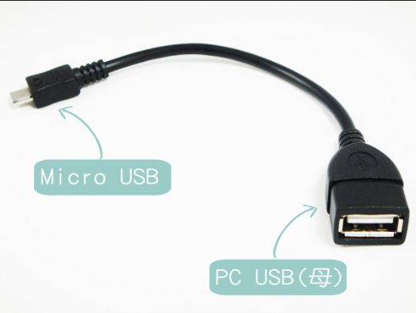

# 轉接器模式 Adapter Pattern
  
####目的：將一個介面轉換成另外一個介面，讓原本與客戶端不能相容的介面可以正常工作

  
轉接器就是像上面這種東西，USB轉micro USB，三孔插座轉兩孔，220V電壓轉110V電壓之類的，生活中到處都可以看到轉接器。


###除了法師，弓箭手也會丟火球!!?
為了繼續活在RPG的世界中，這例子我想了很久，畢竟不能拿飲料店轉接電源當作範例。  
  
今天有一群冒險者們很開心的組隊出門要來解任務了，走到一半才發現他們需要一個法師來丟火球才能完成任務，
如果回到村莊重新招募一個會丟火球的法師，那之前辛苦走的路程都白費了，還好隊伍之中有一個弓箭手，只要將弓箭
包上布，點火後射出去，弓箭手彷彿就對丟火球了一樣。  

上面就是一套轉接器模式的實現，弓箭手是我們的被轉接者Adpatee，法師是轉接後的介面Target，當然負責轉接的
轉接器Adapter。

類別圖：  
  
   
程式碼：  
被轉接者Adpatee與轉接後目標Target
```
/**
 * 弓箭手介面(Adpatee) 
 * 等等要被轉接成法師介面
 */
public interface Archer {
	// 射弓箭
	void shot();
}

/**
 * 具體的弓箭手
 */
public class NormalArcher implements Archer{
	@Override
	public void shot() {
		System.out.println("射箭");
	}
}


/**
 * 法師介面(Target)
 */
public interface Wizard {
	// 丟火球
	void fireBall();
}
```
轉接器
```
/**
 * 轉接器(Adapter)
 * 將弓箭手當作法師來用
 */
public class Adapter implements Wizard {
	private Archer archer;
	
	public Adapter(Archer archer){
		this.archer = archer;
	}
	
	@Override
	public void fireBall() {
		System.out.print("在弓箭上包一層布 -> 淋上花生油 -> 點火");
		archer.shot();
		System.out.println("火球飛出去了");
	}
}
```
測試碼
```
/**
 * 轉接器模式-測試(Client)
 */
public class AdapterClient {
	@Test	public void test(){
		System.out.println("============轉接器模式測試============");
		
		System.out.println("我們需要火球才能把樹上的蜂窩砸爛，糟糕的是隊伍中沒有法師");
		System.out.println("幸好隊伍中有一個弓箭手跟馬蓋先工具包，讓弓箭手也能發火球：");
		Wizard wizard = new Adapter(new NormalArcher());
		wizard.fireBall();
	}
}

```
測試結果
```
============轉接器模式測試============
我們需要火球才能把樹上的蜂窩砸爛，糟糕的是隊伍中沒有法師
幸好隊伍中有一個弓箭手跟馬蓋先工具包，讓弓箭手也能發火球：
在弓箭上包一層布 -> 淋上花生油 -> 點火射箭
火球飛出去了
```


  
  
以下代碼可以看的出來，裝飾模式與轉接器模式在客戶端的調用是一樣的，差別在於裝飾模式不會改變被裝飾者的介面，
轉接器則是將被轉接者的介面換成目標介面。


```
/**
 * 冒險者使用不同稱號來強化-測試(裝飾模式)
 */
public class TitleTest {
	@Test
	public void test(){
		System.out.println("---取得強壯稱號的jacky---");
		TitleStrong sJacky = new TitleStrong(new Lancer("Jacky"));
		sJacky.attack();
	}
}


/**
 * 弓箭手轉接成法師丟火球-測試(轉接器模式)
 */
public class AdapterClient {
	@Test	public void test(){
		Wizard wizard = new Adapter(new NormalArcher());
		wizard.fireBall();
	}
}
```