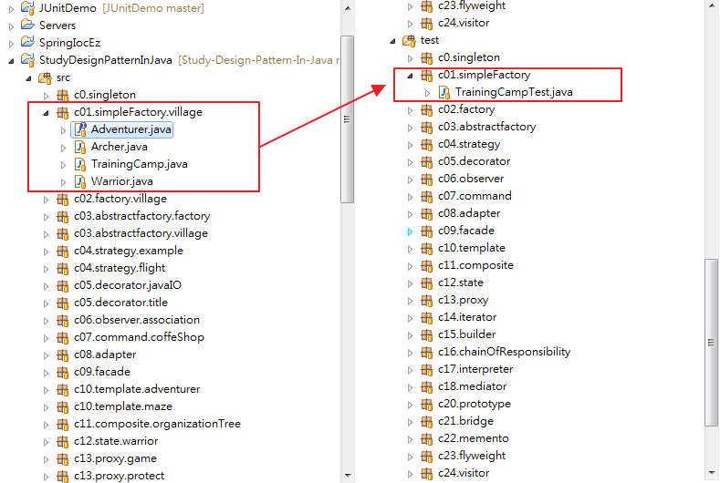
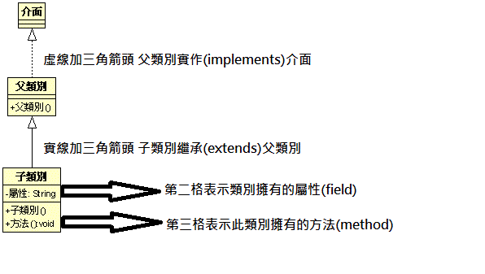
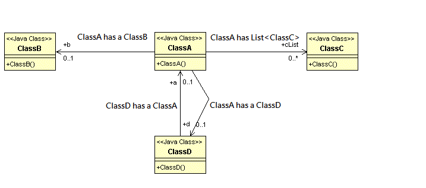

# 閱讀之前


####1.你要知道什麼物件導向程式語言(OOP)
閱讀本書的基礎條件是你要熟悉物件導向，介面(interface)、類別(class)、物件(Object)、封裝(Encapsulation)、
繼承(Inheritance)、多型(Polymorphism)這些物件導向常用的名詞如果你不熟悉或根本不認識，建議你趕快丟下這本書，
去找一些基礎JAVA教學的書籍來看。

####2.本書的範例程式
本書所有的範例程式都放在[Github](https://github.com/skyyen999/StudyDesignPatternInJavaCode.git)，可自行下載，
所有的範例程式資料夾(src)與測試程式資料夾(test)是分開放的，測試程式會放在對應的package裡面，如下圖所示，src->c01.simpleFactory.village裡面所有的測試碼都放在test->c01.simpleFactory之中。  
  
  
所有程式的入口點都會放在執行測試程式，大部分的測試都是使用JUnit4來執行，如果你沒聽過JUnit或是根JUnit不熟悉的話
沒關係，這很簡單的，[附錄A:JUint簡介](junit.md)會稍為說一下JUnit如何使用。


####3.設計模式的類別圖
  
在設計模式中會常常看到類別圖，下面這張圖說明類別圖怎麼看，
如程式碼，父類別implements介面，子類別extends父類別。
```
public interface 介面 {

}
public class 父類別 implements 介面{

}
public class 子類別  extends 父類別{
	private String 屬性;
	public void 方法(){
		new ClassA();
	};
}
```



下面這張顯示類別之間的依賴關係，我們先看由ClassA指向ClassB的箭頭，箭頭旁邊的0...1表示ClassA之中有一個ClassB，
箭頭上方的b表示在ClassA中的ClassB名稱是b。ClassA指向ClassC的箭頭，0...*表示ClassA中有一個List，List裡面放著多個C類別。
下方的箭頭表示ClassA中有一個ClassD，ClassD裡面也有一個ClassA。

```
public class ClassA {
	public ClassD d;
	public ClassB b;
	public List<ClassC> cList;
}
public class ClassB {

}
public class ClassC {

}
public class ClassD {
	public ClassA a;
}
```

- - -
  
##什麼是設計模式?
設計模式如何解決一些重複性問題的經驗累積，因此有些高手直接說設計模式的聖經，
Gof的 Design Patterns: Elements of Reusable Object-Oriented Software一書只是把本來就應該知道的事情寫成書，
毫無參考價值，也有人認為設計模式是對於語言本身缺陷的一種補充，每種程式語言都有各自的優缺點，
因此同樣設計模式在不同的語言之間呈現出來的樣子會有不小的差異，在這個筆記中是使用JAVA做為範例。
每一種模式都是創造出來產生一種特定的重複性問題，例如說單例模式(Singleton)就是為了確保一個類別只會被實體化一次，
學習設計模式最困難不是範例程式碼的複雜物，而是搞清楚這模式要解決怎麼樣的問題，什麼樣的時機適合用這個模式，才是學習的重心。
