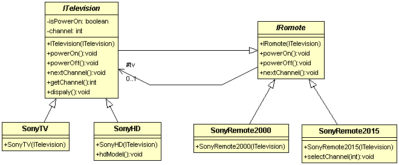

# 橋梁模式 Bridge Pattern

####目的：將抽象介面與實作類別切開，使兩者可以各自變化而不影響彼此  

###電視機與搖控器  
控制器介面規範開關電源的功能與選台功能，電視機上有電源開關與選台按鈕，因此電視機可以看做是控制器介面的實作，
另外還有搖控器也實作了控制器介面，如果讓電視機，搖控器都實作了控制器介面，當搖控器修改時，會影響到電視機，
反之電視機如果增加新功能，那舊有的搖控器也要調整，因此這邊用橋接模式將控制器介面與電視機分離。

類別圖：  
   

程式碼：  
```
/**
 * 控制器介面
 */
public abstract class IRomote {
	protected ITelevision tv;
	
	public IRomote(ITelevision tv){
		this.tv = tv;
	}
	
	/**
	 * 開關電源
	 */
	public void powerOn(){
		tv.powerOn();
	} ;
	public void powerOff(){
		tv.powerOff();
	} ;
	
	/**
	 * 下一個頻道
	 */
	public void nextChannel(){
		tv.nextChannel();
	}
}


/**
 * 電視機介面
 */
public abstract class  ITelevision extends IRomote {
	public ITelevision(ITelevision tv) {
		super(tv);
	}

	private boolean isPowerOn; // 電視機電源
	private int channel = 1; // 現在頻道
	/**
	 * 開關電源
	 */
	public void powerOn(){
		this.isPowerOn = true;
	} ;
	public void powerOff(){
		this.isPowerOn = false;
	} ;
	
	/**
	 * 切換到下一個頻道
	 */
	public void nextChannel(){
		if(channel > 10){
			this.channel = 1;
		} else {
			channel++;
		}
	} ;
	
	public int getChannel(){
		return this.channel;
	}
	
	public void dispaly(){
		System.out.println("powerOn:" + isPowerOn + " , channel = " + channel);
	}
}


/**
 * 源始的搖控器，沒什麼額外的功能
 */
public class SonyRemote2000 extends IRomote {
	public SonyRemote2000(ITelevision tv) {
		super(tv);
	}
}

/**
 * 新版搖控器，增加了直接選台的功能
 */
public class SonyRemote2015 extends IRomote {
	public SonyRemote2015(ITelevision tv) {
		super(tv);
	}

	/**
	 * 新型搖控器可以直接選頻道
	 */
	public void selectChannel(int i){
		if(i > 10 || i < 1){
			return;
		}
		
		// ITelevision沒有 setChannel，跑迴圈找頻道
		while( i != tv.getChannel()){
			super.tv.nextChannel();
		}
	}
}


/**
 * 橋接模式-測試
 */
public class RemoteTest {

	@Test
	public void test(){
		SonyTV tv = new SonyTV();
		SonyRemote2000 remote2000 = new SonyRemote2000(tv);
		System.out.println("測試電視->");
		tv.powerOn();
		tv.nextChannel();
		tv.dispaly();
		System.out.println("測試搖控器->");
		remote2000.nextChannel();
		remote2000.nextChannel();
		tv.dispaly();

		System.out.println("<----------新型電視--------------->");
		SonyHD hdTv = new SonyHD();
		hdTv.hdModel();
		hdTv.dispaly();
		System.out.println("<----------新型搖控器--------------->");
		SonyRemote2015 remote2015 = new SonyRemote2015(hdTv);
		remote2015.powerOn();
		remote2015.selectChannel(10);
		hdTv.dispaly();
	}
}
```  
