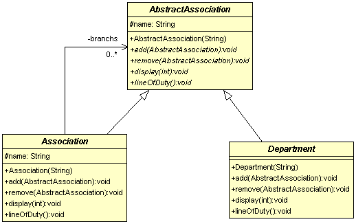

# 合成模式 Compostie Pattern

####目的：處理樹狀結構的資料

###冒險者總會與其他分會
樹狀結構在程式語言的世界中到處可見，例如說資料夾與檔案，html的DOM結構。以下就是樹狀結構圖，從一個根(root)開始，
底下會有節點(Node)，節點可能包含其他節點，如果沒有子分支的節點稱為葉(Leaf)。  
  
  

讓我們繼續賴在冒險者的世界中，經過一段時間的發展，冒險者協會已經在許多城鎮都創立了分會，本來的協會就變成了冒險者總會，
分會之下可能還會有分會，另外每個協會會有一個客戶服務單位(ServiceDepartment)還接受委託與處理客訴，
另外也會有人力資源單位(HumanResouce)來招幕冒險者來處理客戶的委託。這個結構與上面所說的樹狀結構是相同的，總會就是Root，
下面的分會則是有子分支的Node，客戶服務單位與人力資源單位則為Leaf。以下為實作代碼。  


類別圖：  
  

```
/**
 * 協會抽象類別(Component)
 *
 */
public abstract class AbstractAssociation {
	protected String name;
	public AbstractAssociation(String name){
		this.name = name;
	}
	/**
	 * 增加轄下分會或部門
	 * @param a
	 */
	public abstract void add(AbstractAssociation a);
	/**
	 * 移除增加轄下分會或部門
	 * @param a
	 */
	public abstract void remove(AbstractAssociation a);
	/**
	 * 印出組織結構圖
	 * @param depth
	 */
	public abstract void display(int depth);
	
	/**
	 * 印出組織職責
	 */
	public abstract void lineOfDuty();
}

/**
 * 有分支的協會(Composite)
 *
 */
public class Association extends AbstractAssociation{


	private List<AbstractAssociation> branchs = new ArrayList<>();

	
	public Association(String name) {
		super(name);
	}
	
	/**
	 * 增加轄下分會或部門
	 * @param a
	 */
	public void add(AbstractAssociation a){
		branchs.add(a);
	};
	
	/**
	 * 移除增加轄下分會或部門
	 * @param a
	 */
	public void remove(AbstractAssociation a){
		branchs.remove(a);
	};
	/**
	 * 印出組織結構圖
	 * @param depth
	 */
	public void display(int depth){
		for(int i = 0 ; i < depth ; i++){
			System.out.print('-');
		}
		System.out.println(name);
		for(AbstractAssociation a : branchs){
			a.display(depth+2);
		}
	};
	
	/**
	 * 印出組織職責
	 */
	public void lineOfDuty(){
		for(AbstractAssociation a : branchs){
			a.lineOfDuty();
		}
	};
}


/**
 * 部門單位抽項類別(Leaf)
 */
public abstract class Department extends AbstractAssociation {

	public Department(String name) {
		super(name);
	}

	@Override
	public void add(AbstractAssociation a) {
	}

	@Override
	public void remove(AbstractAssociation a) {
	}

	@Override
	public void display(int depth) {
		for(int i = 0 ; i < depth ; i++){
			System.out.print('-');
		}
		System.out.println(name);
	}

	/**
	 * 部門實際的工作由子類別決定
	 */
	@Override
	public void lineOfDuty() {

	}

}


/**
 * 人力支援部門(Leaf)
 */
public class HumanResouce extends Department {

	public HumanResouce(String name) {
		super(name);
	}

	/**
	 * 部門實際的工作由子類別決定
	 */
	@Override
	public void lineOfDuty() {
		System.out.println(name +  ":想辦法拐騙冒險者來完成任務");
	}

}


/**
 * 客服部門(Leaf)
 */
public class ServiceDepartment extends Department {

	public ServiceDepartment(String name) {
		super(name);
	}

	/**
	 * 部門實際的工作由子類別決定
	 */
	@Override
	public void lineOfDuty() {
		System.out.println(name +  ":處理客訴，告訴客戶，這肯定是冒險者的錯，不是協會的錯");
	}

}
```  
