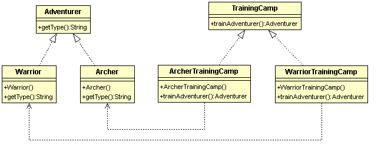

# 工廠模式 Factory Pattern
  
剛才的簡單工廠模式因為只有一個訓練營，要新增冒險者型態時會直接破壞了開放/封閉原則，
在工廠模式中，將訓練營提升為一個抽象的概念(定義什麼是訓練營)，實際上要如何訓練各種冒險者由各種訓練營來實作，
例如說弓箭手訓練營專門訓練弓箭手，鬥士訓練營產生鬥士。如此一來，如果想要增加冒險者的類別，只要新增訓練營實體類別，
而不會改動到抽象的訓練營概念。  
  
類別圖：  
  
   
程式碼：  
```
/**
 *  工廠介面-冒險者訓練營(這只是一個概念或規範，要訓練什麼，怎麼訓練留給子類別實作)
 */
public interface TrainingCamp {
	//訓練冒險者的過程，訓練後請給我一個冒險者
	public Adventurer trainAdventurer();
}

/**
 * 實體工廠-弓箭手訓練營
 */
public class ArcherTrainingCamp implements TrainingCamp {

	@Override
	public Adventurer trainAdventurer() {
		System.out.println("訓練一個弓箭手");
		return new Archer(); 
	}

}

/**
 * 實體工廠-鬥士訓練營
 */
public class WarriorTrainingCamp implements TrainingCamp {
	@Override
	public Adventurer trainAdventurer() {
		System.out.println("訓練一個鬥士");
		return new Warrior(); 
	}
}


// 抽象產品-冒險者
public interface Adventurer {
	//告訴別人你是哪種冒險者
	String getType();}
}

// 產品-弓箭手
public class Archer implements Adventurer {
	@Override
	public String getType() {
		System.out.println("我是弓箭手");
		return  this.getClass().getSimpleName();
	}
}

// 產品-鬥士
public class Warrior implements Adventurer {
	@Override
	public String getType() {
		System.out.println("我是鬥士");	
		return  this.getClass().getSimpleName();
	}
}	

/**
 * 冒險者訓練營測試
 */
public class TrainingCampTest {
	@Test
	public void test(){
		System.out.println("==========工廠模式測試==========");
		
		//訓練營訓練冒險者
		//先用弓箭手訓練營訓練弓箭手
		TrainingCamp trainingCamp = new ArcherTrainingCamp();
		Adventurer memberA = trainingCamp.trainAdventurer();
		
		//用鬥士訓練營訓練鬥士
		trainingCamp = new WarriorTrainingCamp();
		Adventurer memberB = trainingCamp.trainAdventurer();
		
		//看看是不是真的訓練出我們想要的冒險者
		Assert.assertEquals(memberA.getType(), "Archer");
		Assert.assertEquals(memberB.getType(), "Warrior");
	}
}

```
  
簡單工廠模式與工廠模式比較：  
  
*簡單工廠模式：工廠直接負責管理所有的產品，利用if else 或 switch case判斷式來產生產品。  
	
*工廠模式：	工廠提升為一個概念，實際上產生產品的是實作工廠概念的實體工廠。