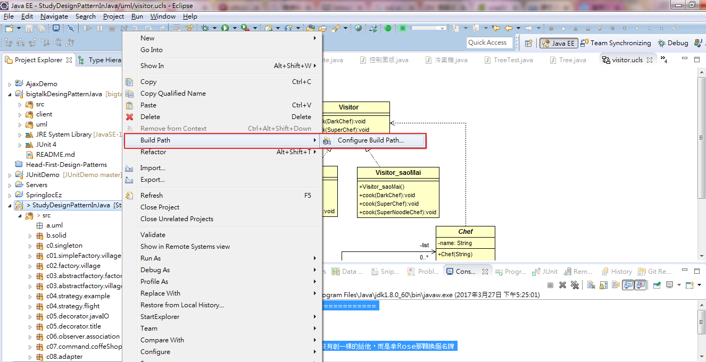
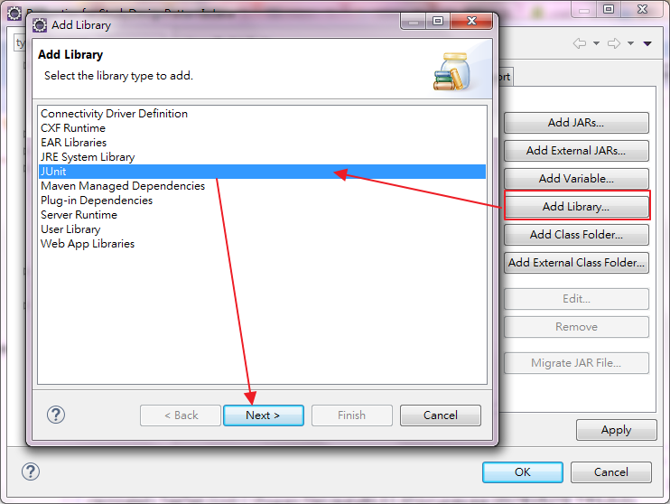
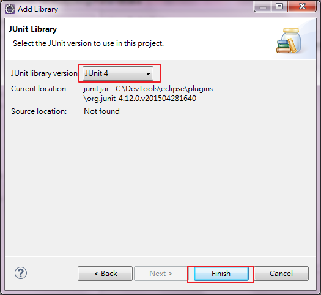
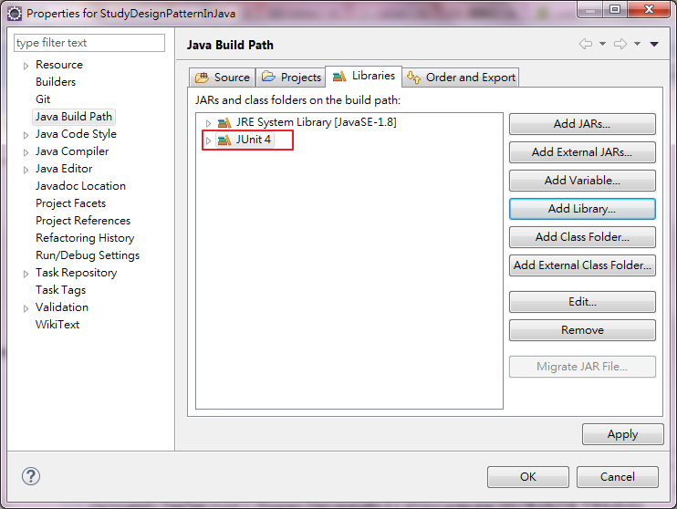
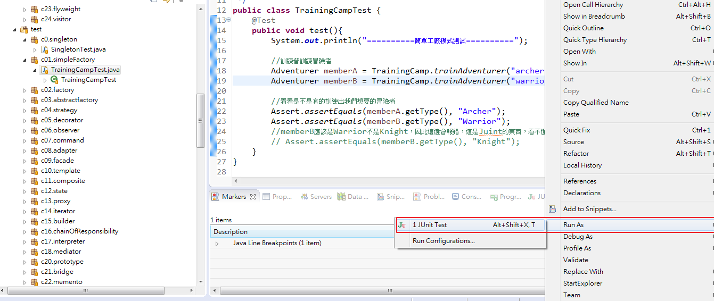
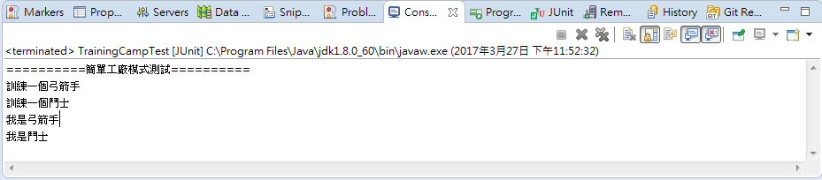
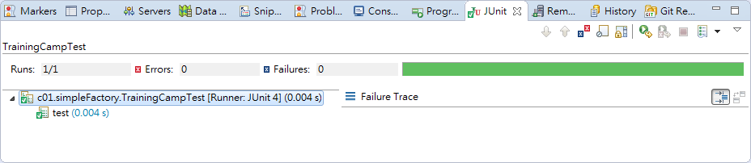
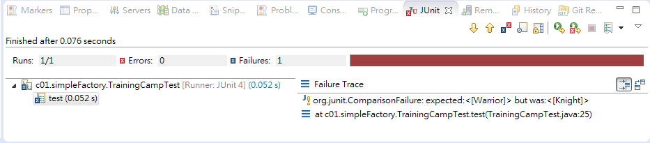

# JUnit4 簡介

##開始使用JUnit

這邊只是稍為簡介一下怎麼執行JUnit，需要較完整的Junit教學，
可以看[https://skyyen999.gitbooks.io/java/content/JUnit/helloJUnit.html](https://skyyen999.gitbooks.io/java/content/JUnit/helloJUnit.html)。

1. 首先我們開起Eclipse，匯入範例程式後，在Project上點右鍵，選取Build path -> Configure Build path  
  
2. 點選Add Library -> JUnit -> Next  
  
3. JUnit4 -> Finished  
  
4. 完成後會看到JUnit4 Library已經加到Project之中  
  

##執行測試與顯示結果

以TrainingCampTest為例，開啟程式後在空白處點右鍵，Run As -> JUnit 

 
####執行後會在console看到執行結果如下
 

####執行後會在Junit看到執行結果如下
都綠色表示通過測試碼中的兩個Assert.assertEquals方法
```
	Assert.assertEquals(memberA.getType(), "Archer");
	Assert.assertEquals(memberB.getType(), "Warrior");
```
   


####測試失敗
現在我們加入一行Assert.assertEquals(memberB.getType(), "Knight")，執行後看結果，出現測試Failures，
這是因為memberB.getType()拿出來的字串是"Warrior"，不等於後面的"Knight"，所以無法通過JUnit的測試。
```
	//memberB應該是Warrior不是Knight，因此這邊會報錯，這是Juint的東西，看不懂可以直接跳過
	Assert.assertEquals(memberB.getType(), "Knight");
```
   


