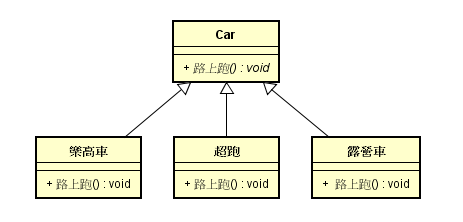
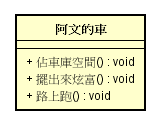
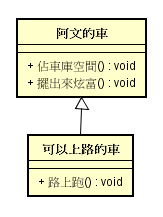

# 物件導向程式設計基本原則 - SOLID

在物件導向程式中，遵循**SOLID**這五項基本原則，可以程式設計師可以寫出好維護、易擴充的程式架構：
  
### S: Single responsibility principle(SRP) 單一職責  
一個類別只負責一件事情，阿文18歲生日後取得汽車駕照，爸爸買一台車可以在天空上飛、在路上走、在水下游泳的車給他當生日禮物，是不是很酷的事情?
可是阿文想開這台車，就必須要有機師職照、汽車駕照、潛水艇駕駛證照才能上路，這台車故障了，就需要修飛機的技師、修汽車的技師、修潛艇的技師一起維修才行。  

如果一個類別負擔太多工作，就會像上面的超級汽車一樣，不論是使用上或是維護上都會造成使用者很大的困擾。
要注意單一職責不是指一個類別裡面只有一個方法，就算是一台普通的車，也會有前進、後退、左轉、右轉等等基本功能吧!  

但是也要注意不要過度把功能切的太細碎造成過度設計的情況，例如將一台車拆程方向盤、大燈、引擎、汽缸等等零件(雖然他們都有各自的功能)，
汽車駕駛人只要知道車子怎麼開就夠了，不需要去理解車子內部詳細的構造。 
致於怎樣算是一個功能，就要視實際的需求而定，其實這是很抽象，也很難釐清的事情，這部分我們就先到這裡就好。
 
## O: Open/close principle(OCP)  開放/封閉原則 
物件導向程式設計最重要的開放(擴充)封閉(修改)原則。一套軟體應該要能擴充新的功能，但如果這些程式碼耦合度(coupling)，
新增功能時還要小心翼翼避免修改到舊的程式碼，工作上就變得很麻煩，因此舊程式碼應該是封閉修改的，
或是某個舊功能需要修改，也不應該取影響到其他功能。  
   
OCP就是開放新增功能，但是封閉修改其他不相關的功能。

## L: Liskov substitution principle(LSP)   Liskov替換  
在一個系統中，子類別應該可以被父類別替換。阿文要開車去阿嬤家，車庫裡面有很多台車，我們只看其中三台車，如下圖：    
  
阿文坐上1:1的樂高模型車後，發現這是樂高積木組成的車，沒有引擎，根本不能上路!!! 這種時候用父類別car去取代子類別樂高車就會有問題。  

## I: Interface Segregation Principle(ISP) 介面隔離
把不同功能的功能從介面中分離出來。 
阿文表示，樂高車也是車，我家的車最主要就是拿來佔車庫避免空間浪費，然後輪流擺在庭院炫富用，用圖表示如下：
  
  
這邊有一個小問題，不是全部的車都可以在路上跑，明顯違反了上一條LSP，因此我們需要將路上跑這個功能分割到其他介面：    

## D: Dependency Inversion Principle(DIP) 依賴反轉
定義：高階模組不應依賴低階模組，兩個都應該依賴在抽象概念上；抽象概念不依賴細節，而是細節依賴在抽象概念。
上面這段文字看起來很抽象，我嘗試翻譯一下，"話不能說的太死，盡量講一些概念性的東西"。  
  
阿文要在庭院要弄一個賞車派對，邀請函上面寫著"阿文誠摯邀請您來欣賞Ferrari FXX超跑"，因此這個派對就被綁死在FXX超跑上面了。
如果當天阿文爸也需要這輛超跑去載小三，阿文在派對那天就只能在朋友面前哭哭了。  
  
為了避免這種事情發生，邀請函上面最好是寫著"阿文誠摯邀請您來欣賞阿文珍藏車"，這樣一來當天他就算從倉庫拿出樂高模型車來展示也可以。

- - - 
#什麼設計模式

以上是一些物件導向程式設計的基本原則，設計模式如何解決一些重複性問題的經驗累積，因此有些高手直接說Gof的
***Design Patterns: Elements of Reusable Object-Oriented Software***一書只是把本來就應該知道的事情寫成書，
毫無參考價值，也有人認為設計模式是對於語言本身缺陷的一種補充，每種程式語言都有各自的優缺點，
因此同一套設計模式在不同的語言之間呈現出來的樣子會有不小的差異，當然這邊是用JAVA做為範例。
  
每一種模式都是創造出來產生一種特定的重複性問題，例如說單例模式(Singleton)就是為了確保一個類別只會被實體化一次，
學習設計模式最困難不是範例程式碼的複雜物，而是搞清楚這模式要解決怎麼樣的問題，什麼樣的時機適合用這個模式，
才是學習的重心。

 
