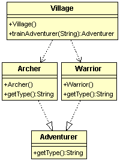

# 簡單工廠模式
  
現在要設計一個訓練冒險者(Adventurer)的新手村(Village)，裡面可以訓練弓箭手(Archer)、鬥士(Warrior)。  

類別圖：  
  
  
程式碼：  
```
// 訓練冒險者的村莊(簡單工廠)
public class Village {
	public Adventurer trainAdventurer(String type){
		switch(type){
			case "archer" : System.out.println("訓練一個弓箭手");return new Archer(); 
			case "warrior": System.out.println("訓練一個鬥士");return new Warrior();
			default : return null;
		}
	}
}

// 冒險者
public interface Adventurer {
	//告訴別人你是哪種冒險者
	String getType();}
}

// 弓箭手
public class Archer implements Adventurer {
	@Override
	public String getType() {
		System.out.println("我是弓箭手");
		return  this.getClass().getSimpleName();
	}
}

// 鬥士
public class Warrior implements Adventurer {
	@Override
	public String getType() {
		System.out.println("我是鬥士");	
		return  this.getClass().getSimpleName();
	}
}	

// 冒險者新手村測試
public class VillageTest {
	@Test
	public void test(){
		//新手村訓練冒險者
		Adventurer memberA = Village.trainAdventurer("archer");
		Adventurer memberB = Village.trainAdventurer("warrior");
	}
}

```
  
以上就是一個簡單工廠模式，如果新手村要多訓練一種冒險者:牧師(Priest)，只要在Villiage trainAdventurer()方法裡面增加一個switch case分支就好。  
問題來了，直接修改Villiage違反了開放/封閉原則，因此一般來說簡單工廠模式不能算是真正的設計模式。
